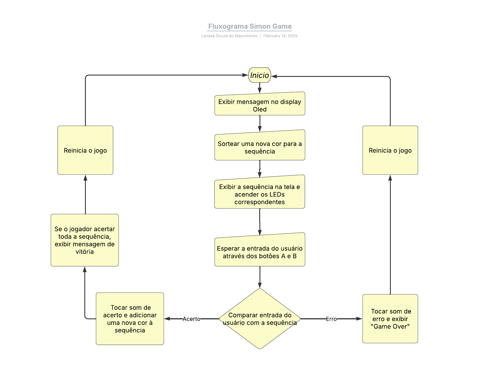

# Simon Game - BitDogLab

Este projeto implementa o clássico jogo **Simon** utilizando a **BitDogLab**. O jogo desafia a memória do jogador ao reproduzir uma sequência de cores e sons, que deve ser repetida corretamente para continuar avançando.

## 🚀 Sobre o Projeto

Este projeto foi desenvolvido como **trabalho final do curso Embarca Tech - IFPI**. O objetivo é explorar conceitos de **sistemas embarcados**, **interação com periféricos** e **lógica de jogo**, utilizando a placa **BitDogLab**. 

## ⚙️ Componentes Utilizados
- 🔴 **Matriz de LEDs e LED RGB**
- 🟢 **Botões A e B de entrada**
- 🔊 **Buzzer para sons**
- 🛠️ **Placa BitDogLab**

## 🎮 Como Funciona?

1. O jogo exibe uma sequência de cores e sons.
2. O jogador deve repetir a sequência pressionando os botões A e B corretamente.
3. A cada acerto, a sequência aumenta em um passo.
4. O jogo é vencido ao atingir **16 acertos consecutivos**.
5. Em caso de erro, o sistema exibe "Game Over" e reinicia automaticamente.
6. Após uma vitória, uma animação de múltiplas cores é exibida por 3 segundos e, em seguida, os LEDs são desligados.

## 🛠 Tecnologias, Interfaces

- **Linguagem C/C++**: Base para o desenvolvimento do firmware.
- **PWM (Pulse Width Modulation)**: Utilizado para controlar o buzzer e gerar diferentes tons sonoros.
- **I2C (Inter-Integrated Circuit)**: Comunicação com o display OLED para exibir mensagens e orientações durante o jogo.


### 📚 Bibliotecas

- `stdio.h` e `string.h`: Bibliotecas padrão do C para entrada/saída e manipulação de strings.
- `pico/stdlib.h`: Fornece funções essenciais, como controle de GPIOs, temporização e inicialização do sistema.
- `neopixel.c`: Biblioteca personalizada para o controle da matriz de LEDs.
- `hardware/pwm.h`: Gerencia o controle do buzzer utilizando **PWM (Pulse Width Modulation)**, que permite a geração de sons com diferentes frequências.
- `hardware/i2c.h`: Interface para comunicação com o display OLED via **I2C (Inter-Integrated Circuit)**, permitindo a troca de dados com apenas dois fios.
- `pico/binary_info.h`: Utilizada para fornecer metadados sobre a compilação e recursos utilizados.
- `inc/ssd1306.h`: Biblioteca responsável pelo controle do display OLED SSD1306.

## 📌 Recursos e Funcionalidades

- ✅ **Sequência Dinâmica**: O jogo aumenta o nível de dificuldade a cada acerto.
- ✅ **Feedback Sonoro**: Sons distintos para acerto, erro e vitória.
- ✅ **Animação de Vitória**: Exibição de diversas cores por 3 segundos ao alcançar o limite de 16 acertos.
- ✅ **Display OLED**: Instruções, status do jogo e mensagens de fim de jogo.
- ✅ **Desligamento Automático dos LEDs**: Os LEDs são desativados após a animação final para economia de energia.

## 🌐 Variáveis Globais
### 🎵 Controle Sonoro
- `#define BUZZER 21`: Define o pino conectado ao buzzer, responsável pelos sons emitidos durante o jogo.

### 💡 Controle de LEDs
- `#define LED_VERMELHO 13`: Pino associado ao LED vermelho.
- `#define LED_VERDE 11`: Pino associado ao LED verde.
- `#define LED_AZUL 12`: Pino associado ao LED azul.

### 🎛️ Entrada de Botões
- `#define BOTAO_A 5`: Pino do botão A, utilizado como entrada para as jogadas do jogador.
- `#define BOTAO_B 6`: Pino do botão B, também utilizado na interação com o jogo.

### 🌈 Matriz de LEDs
- `#define LED_MATRIX_PINO 7`: Pino conectado à matriz de LEDs.
- `#define LED_MATRIX_CONTA 25`: Quantidade de LEDs controlados pela matriz.
- `#define LED_CONTA 25`: Quantidade total de LEDs configurada para o projeto.

### 🔢 Lógica do Jogo
- `#define SEQUENCIA_MAXIMA 16`: Número máximo de elementos na sequência do jogo Simon.

### 🖥️ Display OLED
- `struct render_area frame_area`: Estrutura que define a área de renderização do display OLED.
- `uint8_t ssd[1024]`: Buffer de memória para exibição de mensagens no display OLED.

### 🔗 Comunicação I2C
- `const uint I2C_SDA = 14`: Pino utilizado para a linha de dados da comunicação I2C.
- `const uint I2C_SCL = 15`: Pino utilizado para a linha de clock da comunicação I2C.

### 🧠 Lógica do Jogo Simon
- `int sequencia[SEQUENCIA_MAXIMA]`: Array que armazena a sequência de cores que o jogador precisa repetir.
- `int sequencia_atual = 0`: Índice que indica a posição atual na sequência durante o jogo.

## Principais funções
### 1. `pwm_init_buzzer`

Inicializa o buzzer configurando o pino para gerar sinais PWM. Esta função configura o pino do buzzer para funcionar em modo PWM, permitindo a reprodução de diferentes frequências para gerar sons.
```c
void pwm_init_buzzer(uint pino) {
    gpio_set_function(pino, GPIO_FUNC_PWM);
    uint slice_num = pwm_gpio_to_slice_num(pino);
    pwm_config config = pwm_get_default_config();
    pwm_config_set_clkdiv(&config, 4.0f);
    pwm_init(slice_num, &config, true);
    pwm_set_gpio_level(pino, 0);
}
```
### 2. `tocarNotaDuracao`
Reproduz uma nota musical por um tempo específico, calculando os parâmetros do PWM com base na frequência desejada. Calcula o divisor de clock e o valor máximo (top) para configurar o PWM e gerar a frequência desejada, tocando a nota pelo período especificado.
```c
void tocarNotaDuracao(int frequencia, int duracao) {
    if (frequencia == 0) {
        pwm_set_gpio_level(BUZZER, 0);
        return;
    }
    uint slice_numero = pwm_gpio_to_slice_num(BUZZER);
    uint32_t clock_frequencia = clock_get_hz(clk_sys);
    float clkdiv = 8.0f;
    uint32_t top = (clock_frequencia / (clkdiv * frequencia)) - 1;
    pwm_set_wrap(slice_numero, top);
    pwm_set_clkdiv(slice_numero, clkdiv);
    pwm_set_gpio_level(BUZZER, top / 2);
    sleep_ms(duracao);
    pwm_set_gpio_level(BUZZER, 0);
}
```
### 3. `tocarSomAcerto` e `tocarSomErro`
Toca um som para indicar que a ação do jogador foi correta ou errada.
```c
void tocarSomAcerto() {
    tocarNotaDuracao(523, 150);
    sleep_ms(50);
    tocarNotaDuracao(659, 150);
}
void tocarSomErro() {
    tocarNotaDuracao(300, 150);
    sleep_ms(50);
    tocarNotaDuracao(300, 150);
}
```
### 4. `exibirMensagem`
Exibe uma mensagem no display OLED, atualizando o buffer e renderizando a string. Limpa o buffer do display, desenha a mensagem desejada e atualiza o OLED para exibir o texto.
```c
void exibirMensagem(const char *mensagem) {
    memset(ssd, 0, ssd1306_buffer_length);
    ssd1306_draw_string(ssd, 0, 0, (char *)mensagem);
    render_on_display(ssd, &frame_area);
}
```
### 5. `cor`
Acende o LED correspondente à cor desejada e toca o som associado. Dependendo do valor de color, acende o LED (vermelho, verde ou azul) e toca a nota correspondente para sinalizar a cor.
```c
void cor(int color) {
    if (color == 0) {
        gpio_put(LED_VERMELHO, 1);
        tocarNotaDuracao(300, 300);
        gpio_put(LED_VERMELHO, 0);
    } else if (color == 1) {
        gpio_put(LED_VERDE, 1);
        tocarNotaDuracao(600, 300);
        gpio_put(LED_VERDE, 0);
    } else if (color == 2) {
        gpio_put(LED_AZUL, 1);
        tocarNotaDuracao(450, 300);
        gpio_put(LED_AZUL, 0);
    }
    sleep_ms(200);
}
```
### 6. `comecarSequencia`
Exibe a sequência atual (rodada) no display OLED e nos LEDs. Mostra a rodada atual e, em seguida, percorre a sequência de cores chamando a função cor para cada item. Ao final, avisa o jogador que é sua vez de reproduzir a sequência.
```c
void comecarSequencia(int *seq, int length) {
    char mensagem[50];
    sprintf(mensagem, "Rodada: %d", length);
    exibirMensagem(mensagem);
    sleep_ms(1000);
    for (int i = 0; i < length; i++) {
        cor(seq[i]);
        sleep_ms(200);
    }
    exibirMensagem("Sua vez!");
    sleep_ms(500);
}
```
### 7. `esperarPorUmBotaoPressionado`
Aguarda a entrada do usuário, detectando qual botão foi pressionado e retornando o valor associado à cor. Monitora constantemente os botões com debounce. Se ambos os botões forem pressionados, interpreta como azul; caso contrário, identifica se foi vermelho ou verde e retorna o valor correspondente.
```c
int esperarPorUmBotaoPressionado(void) {
    while (1) {
        bool a = !gpio_get(BOTAO_A);
        bool b = !gpio_get(BOTAO_B);
        if (a || b) {
            sleep_ms(50); // Debounce
            a = !gpio_get(BOTAO_A);
            b = !gpio_get(BOTAO_B);
            if (a && b) {
                while (!gpio_get(BOTAO_A) || !gpio_get(BOTAO_B));
                sleep_ms(50);
                gpio_put(LED_AZUL, 1);
                tocarNotaDuracao(450, 300);
                exibirMensagem("Azul");
                sleep_ms(300);
                gpio_put(LED_AZUL, 0);
                return 2;
            } else if (a) {
                while (!gpio_get(BOTAO_A));
                sleep_ms(50);
                gpio_put(LED_VERMELHO, 1);
                tocarNotaDuracao(300, 300);
                exibirMensagem("Vermelho");
                sleep_ms(300);
                gpio_put(LED_VERMELHO, 0);
                return 0;
            } else if (b) {
                while (!gpio_get(BOTAO_B));
                sleep_ms(50);
                gpio_put(LED_VERDE, 1);
                tocarNotaDuracao(600, 300);
                exibirMensagem("Verde");
                sleep_ms(300);
                gpio_put(LED_VERDE, 0);
                return 1;
            }
        }
        sleep_ms(10);
    }
}
```
### 8. `mostrarCorDisplay`
Atualiza a matriz de LEDs para exibir uma cor definida. Percorre todos os LEDs da matriz, configurando a cor (RGB) para cada um e atualizando o display da matriz.
```c
void mostrarCorDisplay(uint8_t red, uint8_t green, uint8_t blue) {
    for (int i = 0; i < LED_CONTA; i++) {
        npSetLED(i, red, green, blue);
    }
    npWrite();
}
```
### 9. `tocarSequenciaVitoria`
Exibe uma sequência de cores na matriz de LEDs para sinalizar a vitória do jogador. Percorre uma lista de cores pré-definida, exibindo cada cor na matriz de LEDs por um tempo proporcional, e ao final desliga os LEDs.
´´´c
void tocarSequenciaVitoria() {
    uint8_t cores[][3] = {
        {255, 0, 0},    // Vermelho
        {0, 255, 0},    // Verde
        {0, 0, 255},    // Azul
        {255, 255, 0},  // Amarelo
        {0, 255, 255},  // Ciano
        {255, 0, 255},  // Magenta
        {255, 255, 255} // Branco
    };
    int numero_cores = sizeof(cores) / sizeof(cores[0]);
    int duracao_cor = 2000 / numero_cores;

    for (int i = 0; i < numero_cores; i++) {
        mostrarCorDisplay(cores[i][0], cores[i][1], cores[i][2]);
        sleep_ms(duracao_cor);
    }
    mostrarCorDisplay(0, 0, 0);
}
´´´
### 10. `simonGame`
Gerencia a lógica principal do jogo: gera a sequência, exibe para o usuário e verifica se a resposta está correta. Inicializa a sequência e, a cada rodada, adiciona uma nova cor. Exibe a sequência e aguarda a resposta do usuário, verificando se a entrada corresponde ao padrão gerado. Se o jogador errar, encerra a rodada; se completar, o jogo continua ou, ao atingir o máximo, o jogador vence.
```c
void simonGame(void) {
    sequencia_atual = 0;
    exibirMensagem("Simon Game\nComecando!");
    sleep_ms(2000);
    
    while (1) {
        if (sequencia_atual >= SEQUENCIA_MAXIMA) {
            exibirMensagem("Voce venceu!");
            tocarSomAcerto();
            tocarSequenciaVitoria();
            sleep_ms(3000);
            sequencia_atual = 0;
            return;
        }
        
        sequencia[sequencia_atual] = rand() % 3;
        sequencia_atual++;
        
        comecarSequencia(sequencia, sequencia_atual);
        
        for (int i = 0; i < sequencia_atual; i++) {
            int botao = esperarPorUmBotaoPressionado();
            if (botao != sequencia[i]) {
                exibirMensagem("Game Over!");
                tocarSomErro();
                sleep_ms(2000);
                return;
            }
        }
        exibirMensagem("Acertou!");
        tocarSomAcerto();
        sleep_ms(1000);
    }
}
```
### 11. `main`
Inicializa os periféricos, configura o display e os botões, e entra num loop chamando a função do jogo. A função main inicializa os módulos essenciais (PWM, GPIO, I2C, display OLED, matriz de LEDs), exibe as mensagens iniciais e entra num loop que reinicia o jogo após cada término de rodada.
```c
int main() {
    stdio_init_all();
    pwm_init_buzzer(BUZZER);
    
    gpio_init(BOTAO_A);
    gpio_set_dir(BOTAO_A, GPIO_IN);
    gpio_pull_up(BOTAO_A);
    gpio_init(BOTAO_B);
    gpio_set_dir(BOTAO_B, GPIO_IN);
    gpio_pull_up(BOTAO_B);
    
    gpio_init(LED_VERMELHO);
    gpio_set_dir(LED_VERMELHO, GPIO_OUT);
    gpio_init(LED_VERDE);
    gpio_set_dir(LED_VERDE, GPIO_OUT);
    gpio_init(LED_AZUL);
    gpio_set_dir(LED_AZUL, GPIO_OUT);
    
    npInit(LED_MATRIX_PINO, LED_MATRIX_CONTA);
    
    // Inicializa I2C e display OLED
    i2c_init(i2c1, ssd1306_i2c_clock * 1000);
    gpio_set_function(I2C_SDA, GPIO_FUNC_I2C);
    gpio_set_function(I2C_SCL, GPIO_FUNC_I2C);
    gpio_pull_up(I2C_SDA);
    gpio_pull_up(I2C_SCL);
    ssd1306_init();
    
    // Configuração da área de renderização do display OLED
    frame_area.start_column = 0;
    frame_area.end_column = ssd1306_width - 1;
    frame_area.start_page = 0;
    frame_area.end_page = ssd1306_n_pages - 1;
    calculate_render_area_buffer_length(&frame_area);
    memset(ssd, 0, ssd1306_buffer_length);
    render_on_display(ssd, &frame_area);
    
    // Exibe mensagem de mapeamento dos botões
    exibirMensagem("Botao A: Vermelho");
    sleep_ms(3000);
    exibirMensagem("Botao B: Verde");
    sleep_ms(3000);
    exibirMensagem("Ambos: Azul");
    sleep_ms(3000);
    
    srand(time_us_32());
    
    while (1) {
        simonGame();
        exibirMensagem("Reiniciando...");
        sleep_ms(3000);
    }
    
    return 0;
}
```

## 📜 Como Rodar o Projeto?

1. Clone este repositório:
   ```sh
   git clone https://github.com/larissaNa/Simon-game.git
   ```
2. Compile e carregue o código na BitDogLab utilizando o ambiente adequado.
3. Conecte o cabo da BitDogLab no seu pc.
4. Envie o código para a placa e divirta-se jogando!

## 🚨 Observações Importantes
- Certifique-se de que a placa esteja corretamente conectada.
- O tempo de exibição das cores é ajustável no código.
- O efeito final de vitória exibe diversas cores por 2 segundos antes de desligar os LEDs.
- Após uma vitória ou derrota o jogo é inicalizado.

## 🌀 Fluxograma



## 📸 Demonstração

## 👩‍💻 Estrutura do Código
- `simon_game.c` - Código principal com a lógica do jogo.
- `neopixel.c` - Funções para controle da matriz de LEDs.
- `display.c` - Controle do display OLED.
- `CMakeLists.txt` - Configuração para compilação.

## 👥 Autora

- **Larissa Souza do Nascimento**

--
🚀 **Divirta-se e desafie sua memória com o Simon Game!** 🧠💡

## 📜 Licença

Este projeto é de código aberto e pode ser utilizado livremente para fins educacionais e de aprendizado.

---

💡 Desenvolvido para o curso **Embarca Tech - IFPI**

